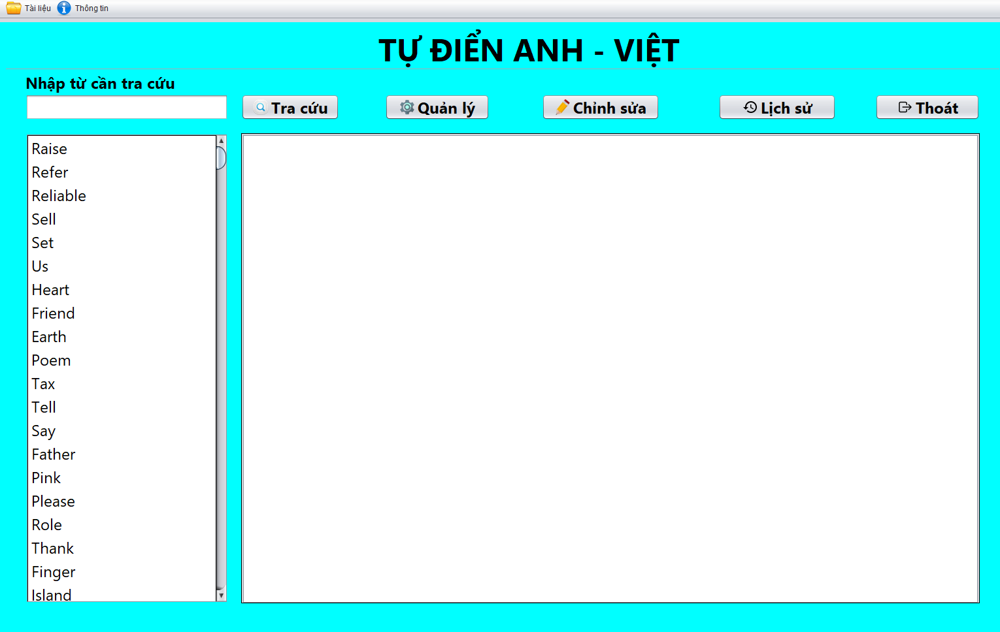
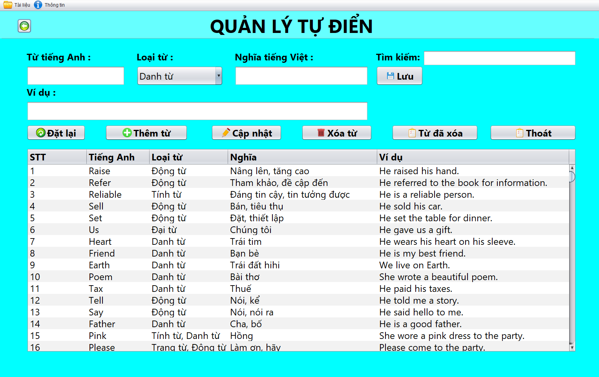
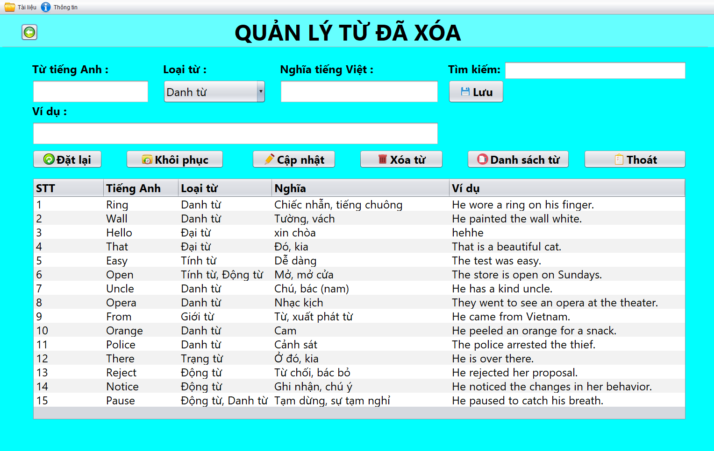
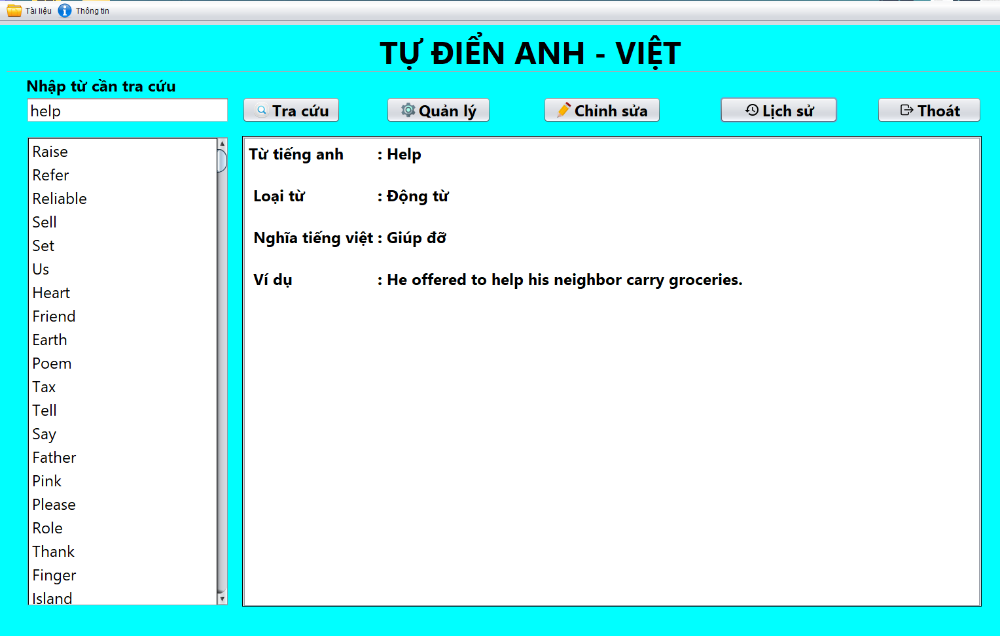
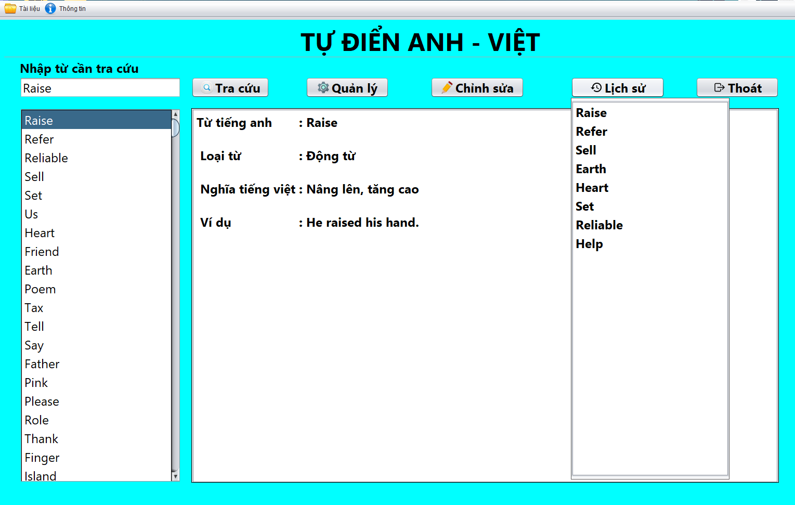
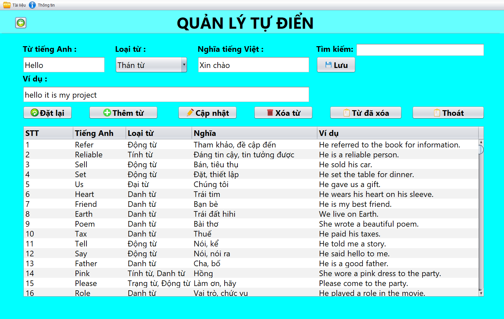
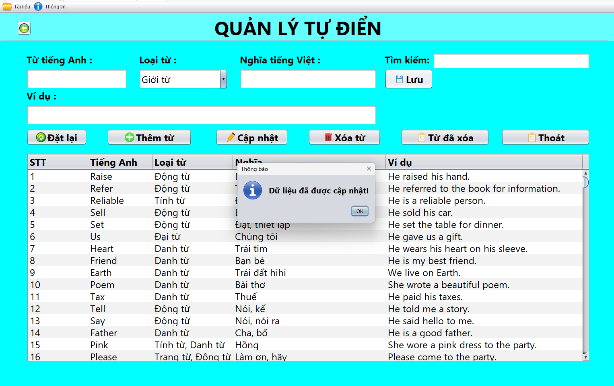
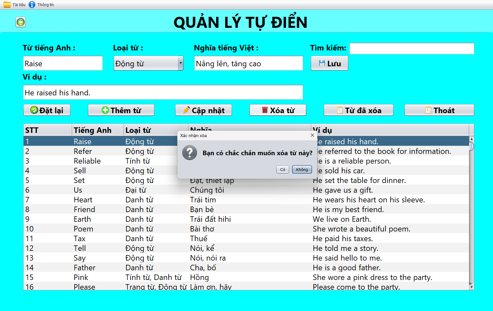
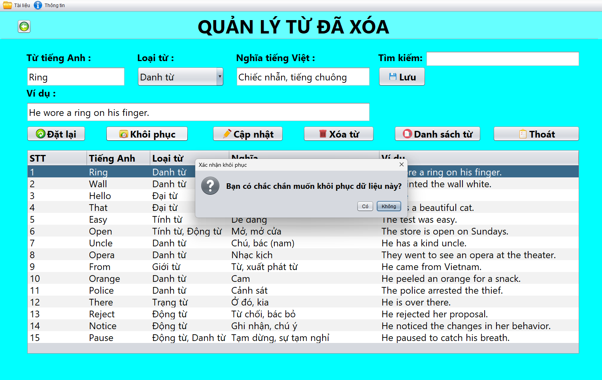

# CT239-Dictionary

## 🤔Mục đích

Xây dựng Phần mềm “Quản lý tự điển” đặt ra yêu cầu chủ yếu và trọng tâm thực hiện các
thao tác quản lý và học tập với tự điển như thêm, sửa, xóa, tra cứu, khôi phục từ và lưu
trữ thông tin tự điển.

## 👍Chức năng cơ bản

### Phía Server:

- **Tra cứu**: Người dùng nhập từ cần tra cứu vào ô, chương trình sẽ lọc ra các từ có liên quan với từ đang nhập. Người dùng có thể sửa dụng nút “Tra cứu”, click chọn hoặc nhấn phím Enter để tra cứu.
- **Thêm từ**: Người dùng nhập thông tin từ cần thêm và chọn nút "Thêm từ".
- **Cập nhật**: Cho phép người dùng chỉnh sửa thông tin của từ trong các ô dữ liệu, chọn tiếp nút “Lưu” để cập nhật lại dữ liệu vào tự điển.
- **Xóa từ**: Cho phép người dùng xóa mềm từ khỏi tự điển, và có thể xóa vĩnh viễn từ khi cần thiết ở "Quản lý từ đã xóa".
- **Khôi phục từ**: Cho phép người dùng khôi phục lại một hoặc nhiều từ đã xóa cùng một lúc.
- **Xem lịch sử từ đã tra cứu**: Thay đổi mật khẩu khi cần thiết
- **Đọc và lưu trữ dữ liệu bằng file**: Cho phép lưu trữ dữ liệu và truy xuất một cách nhanh chóng.

## 🖥️Giao diện người dùng

#### Giao diện chính "Tự điển Anh - Việt"

#### Giao diện quản lý tự điển

#### Giao diện quản lý từ đã xóa

#### Tra cứu từ

#### Xem lịch sử từ đã tra cứu

#### Thêm từ

#### Cập nhật từ

#### Xóa từ

#### Khôi phục từ

## 🔧Cài đặt dự án

**Maven**

1. Download dự án về máy bằng link liên kết này:[CT239-Dictionary](https://drive.google.com/file/d/1qPmXuNxKSMANdWW0a2Tl2awZD5_Vl8sc/view?usp=drive_link)
2. IDE: đề xuất Netbeans (mới nhất)
3. Cài đặt JDK >= 20 và apache maven (>= 3.x)
4. Import dự án vào Netbean và sử dụng

## 📺Công nghệ sử dụng

- **Frontend**
  Java swing
- **Kiến trúc**
  Mô hình MVC

# CT239 - 2024
